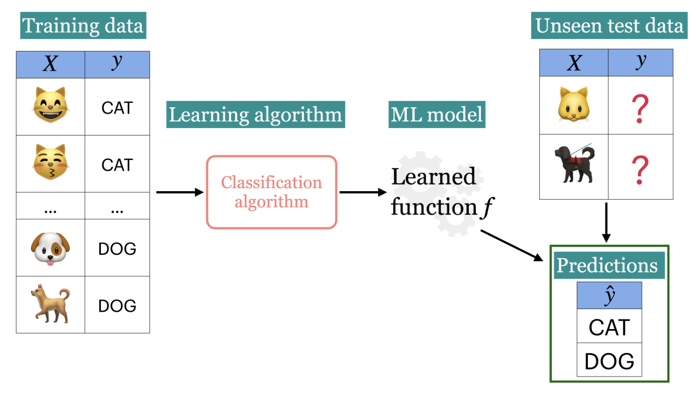
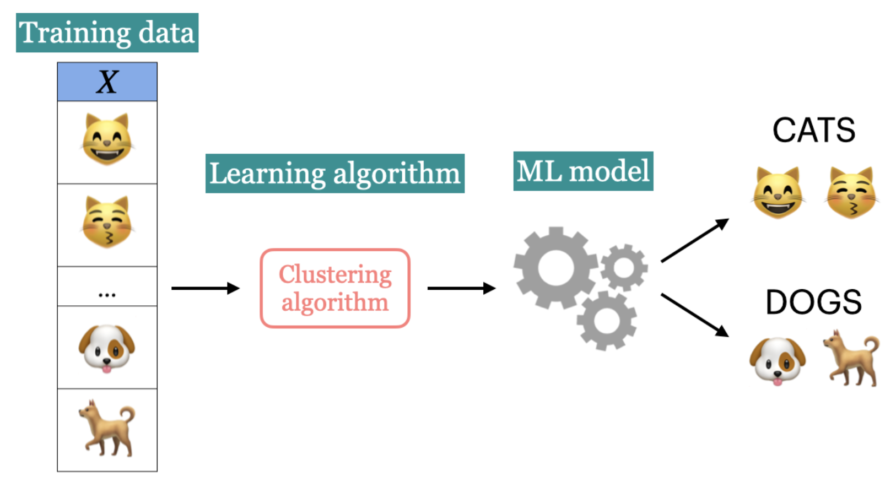
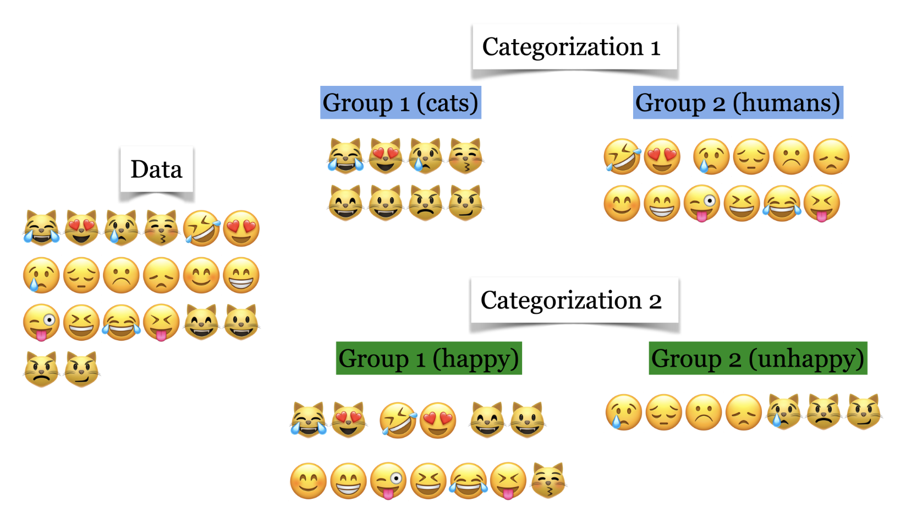
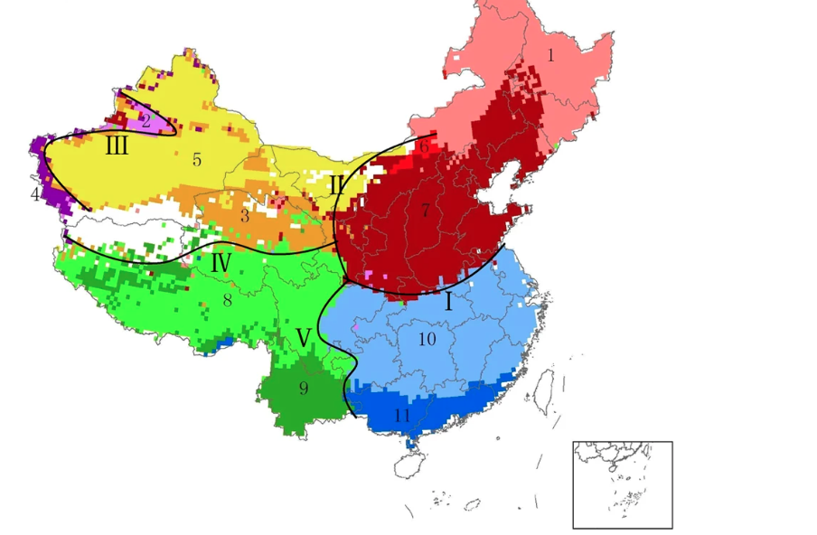
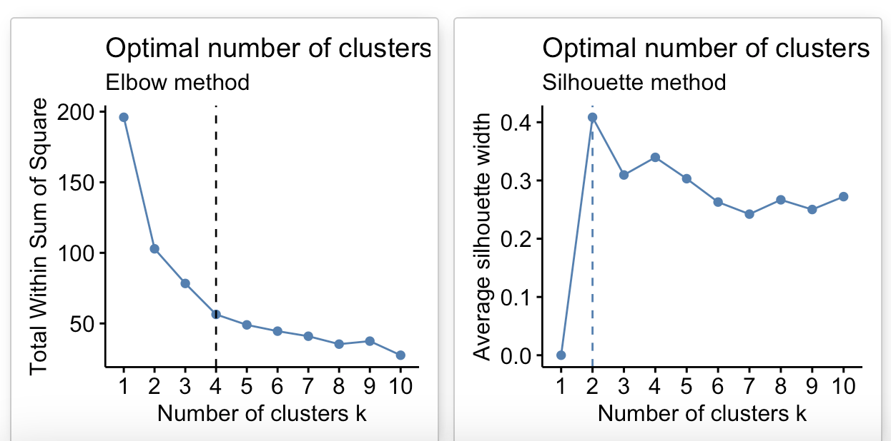

```{r setup, include=FALSE}
options(htmltools.dir.version = FALSE)
```


class: inverse, center, middle

# K-Means Clustering

---
# Goals of the lecture

- **Understand the principles of clustering and K-Means.**

- **Learn how to implement K-Means.**

- **Interpret and evaluate K-Means clustering results.**

- **Explore practical applications of K-Means and best practices.**


---


# Types of Machine Learning


```{r, echo=FALSE, message=FALSE, fig.align='center', out.width='100%'}

library(DiagrammeR)

graph <- grViz(
  "digraph ML_Types {
    graph [layout = dot, rankdir = TB]
    node [shape = box, style = filled, fillcolor = lightblue]
    ML [label = 'Machine Learning', shape = ellipse, fillcolor = lightgray]
    SL [label = 'Supervised Learning']
    UL [label = 'Unsupervised Learning']
    RL [label = 'Reinforcement Learning']
    RS [label = 'Recommendation Systems']
    
    ML -> SL
    ML -> UL
    ML -> RL
    ML -> RS
  }"
)

graph


```


---

# Supervised Learning





---
#Unsupervised Learning




---
# Unsupervised Learning

Can we make sense of data without a target variable? 

--

- **Yes**, at least to some extent. Although our focus would shift to finding the underlying structure of the input data instead of function between input and output like in supervised learning.

--

- Examples include:
  -  Clustering (e.g., K-Means)
  -  Dimensionality Reduction (e.g., PCA)


--


---
class: inverse, center, middle

# Clustering


---

# <span style="font-size: 35px;">Clustering</span>


Partitioning data into groups called clusters based on their similarities.

--

- The goal is to discover underlying groups/patterns in a given dataset such that:

--

    - data in the same group are as similar as possible.

    - data in different groups are as different as possible.

--


```{r, echo=FALSE, message=FALSE, warning=FALSE, fig.align='center'}


pacman::p_load(ggplot2, gridExtra,dplyr,shiny,stats)


set.seed(99)

# Params
n_samples <- 10
n_features <- 2
n_centers <- 3

# Define distinct cluster centers
centers <- matrix(c(-5, -5, 0, 0, 5, 5), ncol = n_features, byrow = TRUE)

# Simulate data points around each center
X <- do.call(rbind, lapply(1:n_centers, function(i) {
  matrix(rnorm(n_samples * n_features, mean = centers[i, ], sd = 1), ncol = n_features)
}))

# Create a data frame
df <- data.frame(X1 = X[, 1], X2 = X[, 2], Cluster = factor(rep(1:n_centers, each = n_samples)))


#Raw points
p1 <- ggplot(df, aes(x = X1, y = X2)) +
  geom_point(size = 3, color = "gray40") +  # Neutral color
  labs(title = "", x = "Feature 1", y = "Feature 2") +
  theme_minimal()

# Colored points (showing clusters)
p2 <- ggplot(df, aes(x = X1, y = X2, color = Cluster)) +
  geom_point(size = 3) +
  labs(title = "", x = "Feature 1", y = "Feature 2") +
  theme_minimal() +
  scale_color_manual(values = c("red", "blue", "green"))

# side by side plots
grid.arrange(p1, p2, ncol = 2)


```


---

# <span style="font-size: 40px;">Clustering</span>

- What is the "correct" grouping here?





---

# <span style="font-size: 40px;">Use Cases: Document Clustering</span>
Group different topics from different articles or new soruces.


---

# <span style="font-size: 30px;">Use Cases: Species Distribution and Habitat Classification</span>

We can cluster ecoregions based on environmental variables (temperature, precipitation, etc) to identify distinct habitat types.

.center[
  

  *Source: [Zhang et al., 2016](https://www.nature.com/articles/srep22400)*
]


---

# <span style="font-size: 30px;">Other Common Applications</span>

- **Genetic and Genomic Clustering**: cluster genes with similar expression patterns in transcriptomics studies.

--


- **Social Network Analysis**

--


- **Customer segmentation**


---
class: inverse, center, middle

# K-Means clustering

---

# <span style="font-size: 40px;">K-Means clustering</span>

K-Means is among the most widely used algorithms for clustering data

- **Input**
  - $X$ -> set of data points
  - $k$ -> number of clusters

--

- **Output**

  - $k$ clusters of the data points

---

# KMeans

.center[
```{r echo=FALSE, message=FALSE, warning=FALSE}

# Create a data frame
df <- data.frame(X1 = X[, 1], X2 = X[, 2], Cluster = factor(rep(1:n_centers, each = n_samples)))

head(df[, c(1:2)], 20)

```
]


---

# KMeans

.center[
```{r echo=FALSE, message=FALSE, warning=FALSE}

#Raw points
p1


```
]


---
# <span style="font-size: 40px;">KMeans</span>


```{r, echo = TRUE}

# K-means clustering
kmeans_result <- kmeans(X, centers = 3, nstart = 10)

kmeans_result$cluster

```

--

The output of KMeans is n_clusters (groups) of the data points


--

Now, we can retrieve the cluster assignment for each observation and add them to the data.

```{r, echo=FALSE}
# Now, we can retrieve cluster labels
clust_labels <- kmeans_result$cluster


#clust_labels


# Convert the matrix 'X' to a data frame and assign column names
sample_data <- as.data.frame(X)
colnames(sample_data) <- c('feat1', 'feat2')

# Add the cluster labels as a new column
sample_data$`cluster labels` <- clust_labels

#print(sample_data)


#just for showing all clusters
set.seed(999)

# n samples per cluster
samples_per_cluster <- 3 

# Perform stratified sampling
stratified_sample <- sample_data %>%
  group_by(`cluster labels`) %>%
  sample_frac(size = 0.3, replace = FALSE) %>%
  #sample_n(size = samples_per_cluster, replace = FALSE) %>%
  ungroup()

# Display the stratified sample
print(stratified_sample)


```


---
#KMeans

In KMeans, each cluster is usually denoted by its center/centroid

.center[
```{r echo=FALSE, message=FALSE, warning=FALSE}

# Create a data frame for plotting
df_kmeans <- data.frame(X1 = X[, 1], X2 = X[, 2], Cluster = factor(clust_labels))

# Extract cluster centers
cluster_centers <- as.data.frame(kmeans_result$centers)

# Plot clustered data points
p3 <- ggplot(df_kmeans, aes(x = X1, y = X2, color = Cluster)) +
  geom_point(size = 3) +
  labs(title = "Clustered Data Points", x = "Feature 1", y = "Feature 2") +
  theme_minimal() +
  scale_color_manual(values = c("red", "blue", "green"))

# Plot cluster centers
p4 <- p3 +
  geom_point(data = cluster_centers, aes(x = V1, y = V2), color = "black", shape = 8, size = 5) +
  labs(title = "Clustered Data Points with Centers")

# Display the plot
print(p4)

```
]

---
#KMeans Prediction

```{r echo=TRUE, message=FALSE, warning=FALSE}


# predict cluster assignments for new data points
predict_kmeans <- function(model, newdata) {
  centers <- model$centers
  distances <- as.matrix(dist(rbind(centers, newdata)))[-(1:nrow(centers)), 1:nrow(centers)]
  max.col(-distances)
}

# New data points
new_examples <- matrix(c(-2, -2.5, 2, 4), ncol = 2, byrow = TRUE)

# Predict cluster assignments for new data points
new_labels <- predict_kmeans(kmeans_result, new_examples)
new_labels


```


---
#KMeans Prediction

Now, we can visualize the clusters, centers and new data points

.center[
```{r echo=FALSE, message=FALSE, warning=FALSE}


# Create a data frame for the original data
df_new <- data.frame(X1 = X[, 1], X2 = X[, 2], Cluster = factor(kmeans_result$cluster))

# Create a data frame for the cluster centers
centers_df <- data.frame(X1 = kmeans_result$centers[, 1], X2 = kmeans_result$centers[, 2])

# Create a data frame for the new examples
new_df <- data.frame(X1 = new_examples[, 1], X2 = new_examples[, 2], Cluster = factor(new_labels))

# Plot
ggplot() +
  # Plot original data points
  geom_point(data = df_new, aes(x = X1, y = X2, color = Cluster), shape = 16, size = 3) +
  # Plot cluster centers
  geom_point(data = centers_df, aes(x = X1, y = X2), color = "black", shape = 8, size = 5) +
  # Plot new data points
  geom_point(data = new_df, aes(x = X1, y = X2, color = Cluster), shape = 17, size = 4) +
  labs(title = "K-Means Clustering with New Data Points",
       x = "Feature 1", y = "Feature 2") +
  theme_minimal() +
  scale_color_manual(values = c("red", "blue", "green"))


```
]


---

# K-Means algorithm


In K-Means clustering, the objective is to represent each cluster by its centroid and assign each data point to a cluster. 

--

But this is a bit complex in reality:

--
  - **Assigning Data Points**: If the cluster centers were known, each data point could be assigned to the nearest center.
  
--

  - **Determining Cluster Centers**: Conversely, if the cluster assignments were known, the centers could be computed as the mean of the assigned points.


--

The problem, however, is we neither know the cluster centers nor the assignments(a priori). 

--

So, how do we resolve that? 

--

_**Iterative approach**_


---

#KMeans algorithm

Recall, 

**Input**: our data points (X) and the number of clusters (K)

**Initialization**: Randomly select initial cluster centers.

**Iterative process**:

  - **Assignment Step**: Assign each data point to the nearest cluster center.
  - **Update Step**: Recalculate the cluster centers as the mean of the assigned points.
  - **Convergence Check**: Repeat the above steps until the assignments no longer change or maximum iterations reached.


---

#Example

So, Let’s execute K-Means algorithm on our simulated data.

```{r echo=FALSE, message=FALSE, warning=FALSE}


# Determine the number of examples (rows) in X
n_examples <- nrow(X)
cat("Number of examples:", n_examples, "\n")

# Display the data matrix X
X[1:10,]

# Set the number of clusters
k <- 3


```

Recall, that $k = 3$


---

#Initialization

.center[
```{r echo=FALSE, warning=FALSE, message=FALSE}

set.seed(999)

centers_idx <- sample(1:n_examples, size = k, replace = FALSE)
centers_it <- X[centers_idx, ]


# Convert data to a data frame for ggplot
df_it <- as.data.frame(X)
colnames(df_it) <- c("Feature1", "Feature2")

# Convert centers to a data frame
centers_df_it <- as.data.frame(centers_it)
colnames(centers_df_it) <- c("Feature1", "Feature2")

# Plot data points and initial cluster centers
ggplot(df_it, aes(x = Feature1, y = Feature2)) +
  geom_point(color = "blue", size = 2) +  # Data points
  geom_point(data = centers_df_it, aes(x = Feature1, y = Feature2), color = "red", size = 4, shape = 8) +  # Initial centers
  labs(title = "Data Points with Initial Cluster Centers",
       x = "Feature 1",
       y = "Feature 2") +
  theme_minimal()


```
]


---

#Next: Iterative process

repeat


  - **Assignment Step**: Assign each data point to the nearest cluster center.
  
  - **Update Step**: Recalculate the cluster centers as the mean of the assigned points.
  
  - **Convergence Check**: repeat the steps untill the assignments no longer change
  


---

#How do we find closest centers?

- First step is to assign examples to the closest center.

- We can consider distance of data to all centers and assign that to the closest center.


--

Let's see this example.

[**Closest Centers Example**](https://hammed.shinyapps.io/shiny_app/)


---
#Finding Closest Centers

```{r echo=TRUE, warning=FALSE, message=FALSE}


# calculate distances and update cluster assignments
update_Z <- function(X, centers) {
  X <- as.matrix(X)
  centers <- as.matrix(centers)
  
  # Number of data points and centers
  n_points <- nrow(X)
  n_centers <- nrow(centers)
  
  # Initialize a matrix to store distances
  dist_matrix <- matrix(0, nrow = n_points, ncol = n_centers)
  
  # Calculate Euclidean distances
  for (i in 1:n_points) {
    for (j in 1:n_centers) {
      dist_matrix[i, j] <- sqrt(sum((X[i, ] - centers[j, ])^2))
    }
  }
  
  # nearest center for each point
  cluster_assignments <- apply(dist_matrix, 1, which.min)
  
  return(list(distances = dist_matrix, assignments = cluster_assignments))
}


```


---

#Update centers

- Now that we have new cluster assignments, we need to update cluster centers.

--

- New cluster centers are means of data points in each cluster.

--

```{r echo=TRUE, warning=FALSE, message=FALSE}

update_centers <- function(X, Z, old_centers, k) {
  # Initialize new centers
  new_centers <- old_centers
  
  # Iterate over each cluster
  for (kk in 1:k) {
    # Identify the indices of data points assigned to cluster kk
    cluster_indices <- which(Z == kk)
    
    # Calculate the mean of these data points to update the cluster center
    if (length(cluster_indices) > 0) {
      new_centers[kk, ] <- colMeans(X[cluster_indices, , drop = FALSE])
    } else {
      # If a cluster has no points assigned, retain the old center
      new_centers[kk, ] <- old_centers[kk, ]
    }
  }
  
  return(new_centers)
}


```


---

#Putting Together


- Initialize

--

- Iteratively alternate between the following two steps.

--

  - Assignments update  $z$ -> we assign each data to the closest center
    
--
  
  - Center Update -> we estimate new centers as average of data in a cluster


---

#Iterations

[**Iterations Example**](https://hammed.shinyapps.io/iteration_app/)


---

#KMeans: When do we stop?

--

- When the centroids are no longer changing

--

- That indicates KMeans convergence, thus we stop!

--

- KMeans will eventually converge, but doesn't necessarily mean it find the "*right*" clusters. It can converge to local optima - the final clusters depend on the starting positions of the centroids.


---
#<span style="font-size: 35px;">Initialization of K-Means is stochastic</span>

--

- Because the initial cluster centers are selected randomly

--

- This means that if you run the K-Means multiple times with different random initializations, you might get **different clustering results**.

--

----

*<span style="font-size: 30px;">Initialization is Important</span>*

--

- K-Means can converge to local optima — the final clusters depend on the starting positions of the centroids.

--

- Poor initialization can lead to:

  - Slow convergence.

--

  - Incorrect clustering.

--

  - Higher final inertia (sum of squared distances from points to cluster centers will be larger).
  
  
  
  
---
class: inverse, center, middle

#How do we decide the value of K?

---

#Hyperparameter Optimization

--

- The number of clusters must be defined before running K-Means.

--

-  For example, in supervised learning, hyperparameter tuning can be done by cross-validation.

--

- However, In unsupervised learning, since we don't have target values, it's harder to evaluate the algorithm’s performance objectively.

--

- There’s no single perfect method for choosing the optimal number of clusters.

--

- However, there are several strategies that can help estimate a suitable value for K.


---

#The Elbow method

--

- This method evaluates the total sum of distances within each cluster, known as inertia

--

- Inertia represents the sum of squared distances between each data point and its assigned cluster center.


--

- the intra-cluster distance can be expressed as:

$$\sum_{P_i \in C_1} \text{distance}(P_i, C_1)^2 + \sum_{P_i \in C_2} \text{distance}(P_i, C_2)^2 + \sum_{P_i \in C_3} \text{distance}(P_i, C_3)^2$$


---

#Inertia

```{r echo=FALSE, message=FALSE, warning=FALSE}


# Generate synthetic data (equivalent to make_blobs)
set.seed(10)
n_samples <- 100
n_features <- 2
n_centers <- 3

# Create random cluster centers and generate data
centers <- matrix(runif(n_centers * n_features, min = -10, max = 10), ncol = n_features)
X_in <- do.call(rbind, lapply(1:n_centers, function(i) {
  matrix(rnorm(n_samples * n_features, mean = centers[i, ], sd = 1), ncol = n_features)
}))

# Plot the data points
df_in <- data.frame(X1 = X_in[, 1], X2 = X_in[, 2])


ggplot(df_in, aes(x = X1, y = X2)) +
  geom_point(size = 2) +
  labs(title = "Data (3 Clusters)") +
  theme_minimal()

```


---

#Inertia

```{r echo=TRUE, warning=FALSE, message=FALSE}

# Function to calculate inertia for different values of K
calculate_inertia <- function(X_in, max_k) {
  inertia_values <- numeric(max_k)
  for (k in 1:max_k) {
    model <- kmeans(X_in, centers = k, nstart = 10)
    inertia_values[k] <- sum(model$withinss)  # Inertia = sum of within-cluster sum of squares
  }
  df_int <- data.frame(K = 1:max_k, Inertia = inertia_values)
  return(df_int)
}


```


---

#Inertia

```{r echo=FALSE, warning=FALSE, message=FALSE}


# Generate inertia values for K = 1 to 10
inertia_df <- calculate_inertia(X_in, 10)

print(inertia_df)

```


--

- From the above table, as $k$ increases, *inertia* decreases


---

#*<span style="font-size: 30px;">So, should the inertia be small or very large?</span>*

--

- Actually, the goal is not to just look for a $k$ that minimizes inertia since it decreases as $k$ increases.

--

For example:

  - If we have number of $k =$ number of data points, each data will have its own cluster and then intra-cluster distance will $= 0$.
  
--
  
  - So, trade-off is necessary here: i.e., we need small $k$ vs small intra-cluster distances. 
  
  


---

#Inertia
.pull-left[
```{r echo=FALSE, warning=FALSE, message=FALSE}

# Function to plot the elbow method
plot_elbow <- function(w, h, inertia_df) {
  ggplot(inertia_df, aes(x = K, y = Inertia)) +
    geom_line(color = "blue") +
    geom_point(size = 2) +
    geom_vline(xintercept = 3, linetype = "dashed", color = "black") +  # Highlight optimal K
    labs(
      title = "Elbow Method for Optimal K",
      x = "Number of Clusters (K)",
      y = "Inertia"
    ) +
    scale_x_continuous(breaks = 1:max(inertia_df$K)) + # x-axis to whole numbers
    theme_minimal(base_size = w + h) + 
    theme(axis.text = element_text(size = w + h))
}


# Plot the elbow plot
plot_elbow(6, 4, inertia_df)

```
]

--

.pull-right[


  - The plot suggests that three clusters should be okay, as indicated by the inflection point on the curve.


  - Although inertia decreases with more than three clusters, the improvement is minimal, so $K = 3$ is a reasonable choice.


  - In our example here, the plot is straightforward to interpret, but it can be challenging in real-world scenarios.

]


---

#Silhouette method

--

- Does not rely on the concept of cluster centroids.

--

- Computed using two metrics for each data point:

--

  - The mean distance to all other points within the same cluster (a).

--

  - The mean distance to all points in the nearest neighboring cluster (b).


---

#Mean intra-cluster distance (a)

--

- For a given sample (e.g., the green point here), calculate the average distance to all other points within the same cluster.

--

- These distances are depicted by black lines connecting the sample to other points in its cluster.


--
.center[
```{r echo=FALSE, warning=FALSE, message=FALSE}
pacman::p_load(cluster,factoextra,ggforce)


# Generate data
set.seed(42)
n_samples <- 30
n_clusters <- 3

X_sil <- data.frame(
  X1 = c(rnorm(n_samples / n_clusters, mean = 0, sd = 0.1),
         rnorm(n_samples / n_clusters, mean = 1, sd = 0.1),
         rnorm(n_samples / n_clusters, mean = 3.5, sd = 0.1)),
  X2 = c(rnorm(n_samples / n_clusters, mean = 0, sd = 0.1),
         rnorm(n_samples / n_clusters, mean = 1, sd = 0.1),
         rnorm(n_samples / n_clusters, mean = 0, sd = 0.1))
)


# Perform K-Means clustering
set.seed(42)
kmeans_result_sil <- kmeans(X_sil, centers = n_clusters, nstart = 10)
X_sil$Cluster <- factor(kmeans_result_sil$cluster)

# Select a sample point from cluster 1 (the green point)
sample_point <- X_sil[which(X_sil$Cluster == 1)[1], ]

# Create a plot showing distances for silhouette
p_sil <- ggplot(X_sil, aes(x = X1, y = X2, color = Cluster)) +
  geom_point(size = 3) + 
  geom_point(data = sample_point, aes(x = X1, y = X2), color = "green", size = 8) +  # Highlight sample point
  
  # Add distances within the same cluster (black lines)
  geom_segment(data = X_sil %>% filter(Cluster == sample_point$Cluster),
               aes(x = sample_point$X1, y = sample_point$X2, 
                   xend = X1, yend = X2),
               color = "black", linetype = "solid", alpha = 0.7) +
  
   # Add distances to other clusters (colored lines)
  geom_segment(data = X_sil %>% filter(Cluster != sample_point$Cluster),
               aes(x = sample_point$X1, y = sample_point$X2,
                   xend = X1, yend = X2, color = Cluster),
               linetype = "solid", alpha = 0.5) +
  
  # Draw cluster boundaries
  stat_ellipse(data = X_sil %>% filter(Cluster == 1), level = 0.99, color = "black") +
  stat_ellipse(data = X_sil %>% filter(Cluster == 2), level = 0.99, color = "blue") +
  stat_ellipse(data = X_sil %>% filter(Cluster == 3), level = 0.99, color = "red") +
  
  labs(
    title = "Distances for Silhouette",
    x = "x1",
    y = "x2"
  ) +
  theme_minimal() +
  scale_color_manual(values = c("black", "blue", "red"))

# Display the plot
print(p_sil)


```
]


---

#Mean nearest-cluster distance (b)


.pull-left[
```{r echo=FALSE, warning=FALSE, message=FALSE}

p_sil

```
]

--

.pull-right[

- The average distance from the green point to the blue points is smaller than to the red points, making the blue cluster the **closest**.


- Thus, the mean nearest-cluster distance $=$ average distance between the green point and the blue points.

]


---

#Silhouette Score for samples
--

- The silhouette distance for a sample is the difference between the mean nearest-cluster distance (b) and the mean intra-cluster distance (a), normalized by the maximum of the two values:

--

i.e.,

$$S = \frac{b - a}{max(a, b)}$$


--

- It ranges from $-1$ to $1$ (worst to best values) with values near $0$ means we have many overlapping clusters.

- Thus, the overall Silhouette score is the average Silhouette scores for all samples.


---

#<span style="font-size: 25px;">How do we use Silhouette scores to select the number of clusters?</span>

--

```{r echo=FALSE, warning=FALSE, message=FALSE, fig.cap=NULL}


# Generate data
set.seed(42)
n_samples <- 150
n_clusters <- 2

# Create random data points around 3 cluster centers
X_sil_k2 <- data.frame(
  X1 = c(
    rnorm(n_samples / 2, mean = 0, sd = 0.5),
    rnorm(n_samples / 2, mean = 3, sd = 0.5)
  ),
  X2 = c(
    rnorm(n_samples / 2, mean = 0, sd = 0.5),
    rnorm(n_samples / 2, mean = 3, sd = 0.5)
  )
)

# Perform K-Means clustering
set.seed(42)
k <- 2
km_sil_k2 <- kmeans(X_sil_k2, centers = k, nstart = 10)

# Compute silhouette scores
sil_k2 <- silhouette(km_sil_k2$cluster, dist(X_sil_k2))


plt_sil_k2 <- fviz_silhouette(sil_k2, print.summary = FALSE) +
  coord_flip() + # Flip the plot horizontally
  scale_fill_discrete(labels = c("1", "2")) +
  guides(col = FALSE) + 
  theme(
    axis.text.x = element_text(size = 10),
    axis.ticks.x = element_line(color = "gray"),
    axis.ticks.y = element_blank(),
    axis.text.y = element_blank()
  )


```


```{r echo=FALSE, warning=FALSE, message=FALSE, fig.cap=NULL}

plt_sil_k2

```


---

#<span style="font-size: 25px;">How do we use Silhouette scores to select the number of clusters?</span>

```{r echo=FALSE, warning=FALSE, message=FALSE, fig.cap=NULL}

# Generate data for k = 3
set.seed(42)
n_samples <- 150
n_clusters <- 3

# Create random data points around 3 cluster centers
X_sil_k3 <- data.frame(
  X1 = c(
    rnorm(n_samples / n_clusters, mean = 0, sd = 0.5),
    rnorm(n_samples / n_clusters, mean = 3, sd = 0.5),
    rnorm(n_samples / n_clusters, mean = 6, sd = 0.5)
  ),
  X2 = c(
    rnorm(n_samples / n_clusters, mean = 0, sd = 0.5),
    rnorm(n_samples / n_clusters, mean = 3, sd = 0.5),
    rnorm(n_samples / n_clusters, mean = 6, sd = 0.5)
  )
)


# Perform K-Means clustering
set.seed(42)
k <- 3
km_sil_k3 <- kmeans(X_sil_k3, centers = k, nstart = 10)

# Compute silhouette scores
sil_k3 <- silhouette(km_sil_k3$cluster, dist(X_sil_k3))

# Plot the silhouette scores
plt_sil_k3 <- fviz_silhouette(sil_k3, print.summary = FALSE) +
  coord_flip() + # Flip the plot horizontally
  scale_fill_discrete(labels = c("1", "2", "3")) +
  guides(col = FALSE) + 
  theme(
    axis.text.x = element_text(size = 10),
    axis.ticks.x = element_line(color = "gray"),
    axis.ticks.y = element_blank(),
    axis.text.y = element_blank()
  )


```


```{r echo=FALSE, warning=FALSE, message=FALSE, fig.cap=NULL}

print(plt_sil_k3)

```


---

#<span style="font-size: 25px;">How do we use Silhouette scores to select the number of clusters?</span>

```{r echo=FALSE, warning=FALSE, message=FALSE, fig.cap=NULL}

# Generate data for k = 4
set.seed(42)
n_samples <- 200
n_clusters <- 4

# Create random data points around 4 cluster centers
X_sil_k4 <- data.frame(
  X1 = c(
    rnorm(n_samples / n_clusters, mean = 0, sd = 0.5),
    rnorm(n_samples / n_clusters, mean = 3, sd = 0.5),
    rnorm(n_samples / n_clusters, mean = 6, sd = 0.5),
    rnorm(n_samples / n_clusters, mean = 9, sd = 0.5)
  ),
  X2 = c(
    rnorm(n_samples / n_clusters, mean = 0, sd = 0.5),
    rnorm(n_samples / n_clusters, mean = 3, sd = 0.5),
    rnorm(n_samples / n_clusters, mean = 6, sd = 0.5),
    rnorm(n_samples / n_clusters, mean = 9, sd = 0.5)
  )
)


# Perform K-Means clustering
set.seed(42)
k <- 4
km_sil_k4 <- kmeans(X_sil_k4, centers = k, nstart = 10)

# Compute silhouette scores
sil_k4 <- silhouette(km_sil_k4$cluster, dist(X_sil_k4))

# Plot the silhouette scores
plt_sil_k4 <- fviz_silhouette(sil_k4, print.summary = FALSE) +
  coord_flip() + # Flip the plot horizontally
  scale_fill_discrete(labels = c("1", "2", "3", "4")) +
  guides(col = FALSE) + 
  theme(
    axis.text.x = element_text(size = 10),
    axis.ticks.x = element_line(color = "gray"),
    axis.ticks.y = element_blank(),
    axis.text.y = element_blank()
  )


```


```{r echo=FALSE, warning=FALSE, message=FALSE, fig.cap=NULL}

print(plt_sil_k4)

```


---

#<span style="font-size: 35px;">Interpretation of Silhouette Plots</span>

--

- Silhouette Values:

  - Higher silhouette values indicate that a data point is close to its own cluster and far from neighboring clusters, suggesting well-separated clusters.
  

--

- Cluster Size Representation:

  - The width of each silhouette reflects the number of data points in the cluster, providing insight into cluster sizes.
  

--

- Cluster Quality:

  - The shape and length of each silhouette $=$ the quality of the clustering; a more rectangular shape with a slower drop-off indicates that more points are appropriately clustered.


---
#Elbow and Silhouette




---

#<span style="font-size: 35px;">Recap and Key Takeaways</span>

--

- The silhouette method can be applied to evaluate the results of different clustering algorithms beyond **K-Means**.
  
  
--

- Remeber, Clustering is an **unsupervised** learning.

--

- **Distance Metrics**: While not extensively covered here, the choice of distance metrics is a crucial factor in clustering, as it influences how similarity between data points is measured.

---
#<span style="font-size: 35px;">Recap and Key Takeaways</span>

--

- K-Means requires specifying the number of clusters $(k)$ in advance.
  
--

- Assigns each data point exclusively to one cluster.
  
--

- The cluster labels generated are arbitrary and no specific meaning.
  
--

- Cluster centroids are computed as the mean of data points within a cluster
  
--

- KMeans always converge: however, that may be suboptimal as it's influenced by the initial centroids.

--

- **Elbow and Silhouette** techniques are commonly used to assess the optimal number of clusters for a given dataset.


--

- *Applications*: Data exploration, feature engineering, customer segmentation, and document clustering.
      
--
- *Interpreting* the results of clustering algorithms often requires manual effort and domain expertise to extract meaningful insights
  
  

---
class: inverse, center, middle

#Thank you

